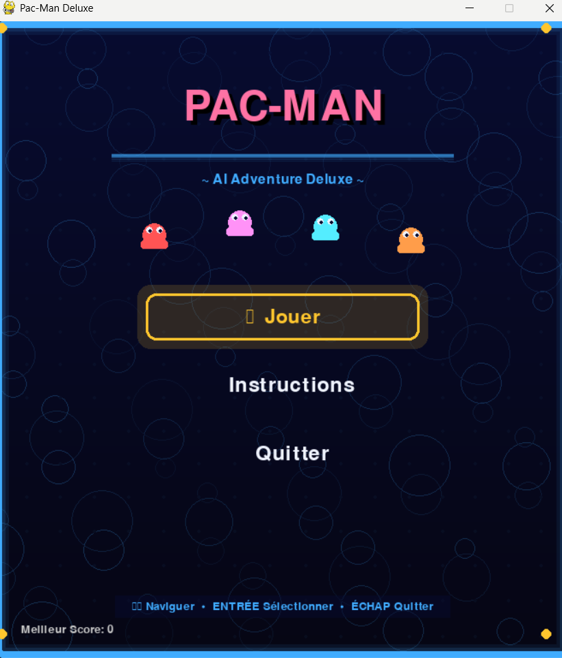
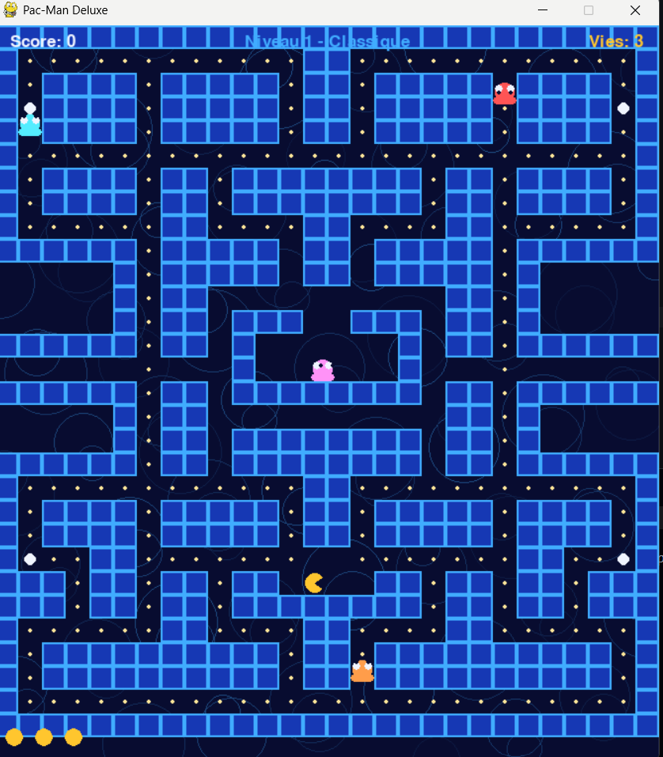
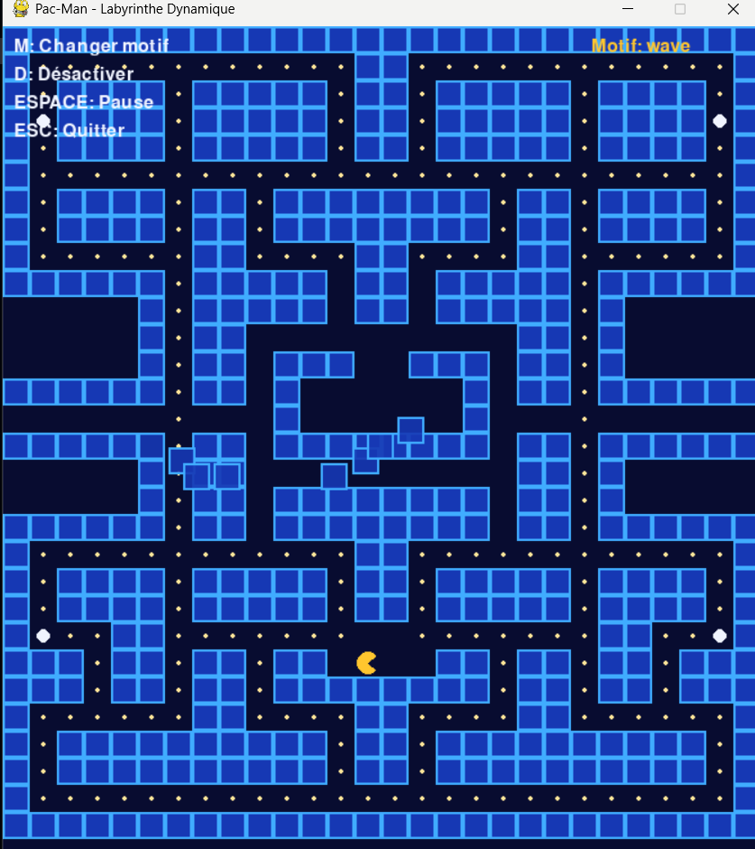

# 🎮 Pac-Man AI Adventure

<div align="center">

[](https://www.python.org/downloads/)
[](https://www.pygame.org/)
[](https://pytorch.org/)
[](LICENSE)

*Un clone moderne de Pac-Man avec intelligence artificielle avancée et apprentissage par renforcement*

[Fonctionnalités](#-fonctionnalités) • [Installation](#-installation) • [Utilisation](#-utilisation) • [Architecture](#-architecture) • [Technologies](#-technologies)

</div>

---

## 🖼️ Aperçu

<div align="center">





</div>

---

## 📋 Description

**Pac-Man AI Adventure** est une implémentation professionnelle du jeu classique Pac-Man en Python avec Pygame. Le projet combine :

- **Pathfinding A* (heuristique Manhattan)** intelligent pour les fantômes et Pac-Man
- **Labyrinthe dynamique** avec murs mobiles (motifs vague, spirale, aléatoire)
- **Difficulté adaptative** qui s'ajuste selon les performances du joueur
- **Module Reinforcement Learning complet** (PyTorch + Gymnasium) pour entraîner Pac-Man ou les fantômes

---

## ✨ Fonctionnalités

### 🤖 Intelligence Artificielle

- **Algorithme A* (heuristique Manhattan)** : Pathfinding optimisé pour grilles de jeu avec cache de chemins
- **4 fantômes avec comportements distincts** :
  - 🔴 Blinky (Rouge) : Agressif et direct
  - 🩷 Pinky (Rose) : Embuscades stratégiques
  - 💙 Inky (Cyan) : Comportement imprévisible
  - 🧡 Clyde (Orange) : Timide mais rusé
- **Modes multiples** : Scatter, Chase, Frightened, Eaten
- **Autopilote Pac-Man** : Navigation automatique vers une destination
- **Replanification en temps réel** lors de changements du labyrinthe

### 🧠 Module Reinforcement Learning

- **Agents DQN** (PyTorch) pour Pac-Man et fantômes
- **Environnement Gymnasium** avec observations complètes et récompenses intelligentes
- **Labyrinthe dynamique** complexifiant l'apprentissage
- **Difficulté adaptative** ajustant la vitesse/intelligence selon les performances
- **TensorBoard** pour visualiser les métriques d'entraînement
- **Sauvegarde/chargement** de modèles en `.pt`

### 🎨 Interface & Graphismes

- Menu principal animé avec effets visuels
- Écran d'instructions détaillé
- Animations fluides des personnages
- Effets de particules et dégradés
- Interface utilisateur intuitive

### 🎮 Gameplay

- Mouvement fluide sur grille avec interpolation
- Système de collision précis
- Régénération automatique des pellets
- Condition de victoire : manger tous les fantômes
- Score et statistiques en temps réel
- Mode "power pellet" pour vulnérabiliser les fantômes

---

## 🚀 Installation

### Prérequis

- **Python 3.10+** (3.11.0 recommandé)
- **pip** (gestionnaire de paquets)
- **PyTorch** (installé automatiquement via `requirements.txt`)
- **Windows PowerShell** ou terminal compatible

### Étapes Installation

```powershell
# 1. Cloner le dépôt
git clone https://github.com/mzmantar/Pac-Man---AI-Adventure.git
cd Pac-Man---AI-Adventure

# 2. Créer environnement virtuel
python -m venv .venv

# 3. Activer l'environnement virtuel
.\.venv\Scripts\Activate.ps1

# Si erreur de politique d'exécution :
# Set-ExecutionPolicy -ExecutionPolicy RemoteSigned -Scope CurrentUser

# 4. Installer les dépendances
pip install -r requirements.txt
```

---

## 🎯 Utilisation

### 🕹️ Lancer le Jeu

```powershell
python main.py
```

#### Contrôles en Jeu

| Touche | Action |
|--------|--------|
| **←→↑↓** | Déplacer Pac-Man |
| **C** | Activer/Désactiver autopilote IA |
| **Clic gauche** | Définir destination (A* automatique) |
| **ÉCHAP** | Pause / Retour au menu |

#### Objectifs

- 🎯 Manger **TOUS** les fantômes pour gagner
- 🔵 Power Pellets rendent les fantômes vulnérables (bleus)
- ⭐ Fantôme mangé = +200 points
- ♻️ Pellets se régénèrent automatiquement

---

### 🧪 Démos RL/IA

```powershell
python demo_rl.py
```

**Option 1 - Labyrinthe Dynamique (interactif)** :
- `M` : Changer motif (vague/spirale/aléatoire)
- `D` : Désactiver mouvements
- `ESPACE` : Pause
- `ESC` : Quitter

**Option 2 - Difficulté Adaptative (simulation)** :
- Observe les ajustements de vitesse/intelligence des fantômes
- 20 parties simulées avec log détaillé

---

### 🤖 Entraîner un Agent RL

```powershell
python -m src.rl.trainer --agent pacman --episodes 1000 --steps 1000 --save-dir models --render
```

**Paramètres** :
- `--agent pacman|ghost` : Qui entraîner
- `--render` : Afficher le jeu pendant l'entraînement
- `--load chemin.pt` : Reprendre un modèle existant
- `--save-dir` : Dossier de sortie (modèles + logs TensorBoard)
- `--episodes` / `--steps` : Limites d'entraînement

**Visualiser les métriques** :
```powershell
tensorboard --logdir models/pacman/logs
```

---

## 🏗️ Architecture

### Structure du Projet

```
pac_man/
│
├── main.py                 # Point d'entrée principal
├── demo_rl.py              # Démos labyrinthe dynamique + difficulté adaptative
├── requirements.txt        # Dépendances Python
├── README.md              # Cette documentation
│
└── src/
    ├── __init__.py
    ├── settings.py        # Constantes, couleurs, configuration
    ├── menu.py            # Système de menus avec animations
    ├── game.py            # Boucle principale du jeu
    ├── maze.py            # Labyrinthe, pellets, génération
    ├── entities.py        # Pac-Man, Ghosts, entités du jeu
    │
    ├── ai/
    │   ├── pathfinding.py # Implémentation A*
    │   └── controller.py  # Logique décision fantômes
    │
    └── rl/
        ├── adaptive_difficulty.py # Gestionnaire difficulté adaptative
        ├── dynamic_maze.py        # Labyrinthe avec murs mobiles
        ├── rl_environment.py      # Environnement Gymnasium
        ├── rl_agent.py            # Agents DQN (PyTorch)
        └── trainer.py             # Script d'entraînement + TensorBoard
```

### Modules Clés

#### 🎮 `game.py`
Boucle principale, gestion événements, collisions, rendu victoire/défaite

#### 🗺️ `maze.py`
Génération labyrinthe, gestion pellets, régénération, affichage terrain

#### 👾 `entities.py`
Classes Pacman et Ghost avec animations, états, modes

#### 🤖 `ai/pathfinding.py`
**Algorithme A* (Heuristique Manhattan)** : Optimisé pour grilles, cache de chemins pour performance, utilisé par tous les agents

#### 🧠 `ai/controller.py`
Gestion modes fantômes, calcul cibles, coordination multi-agents

#### 💡 `rl/rl_agent.py`
Agents DQN, réseaux de neurones PyTorch, replay buffer, epsilon-greedy

#### 🎓 `rl/rl_environment.py`
Environnement Gymnasium, observations, actions, récompenses

#### 📈 `rl/trainer.py`
Script d'entraînement avec TensorBoard, sauvegarde modèles, évaluation

#### ⚙️ `rl/adaptive_difficulty.py`
Gestionnaire difficulté, ajustement dynamique basé sur performances

#### 🎨 `rl/dynamic_maze.py`
Labyrinthe avec murs mobiles, motifs (vague, spirale, aléatoire)

---

## 🛠️ Technologies Utilisées

| Technologie | Version | Usage |
|-------------|---------|-------|
| **Python** | 3.11.0 | Langage principal |
| **Pygame** | 2.6.1 | Moteur graphique 2D |
| **PyTorch** | 2.x+ | Deep Q-Learning |
| **Gymnasium** | 0.29.0+ | Environnements RL |
| **TensorBoard** | 2.15.0+ | Visualisation métriques |
| **NumPy** | 1.24.0+ | Calculs numériques |

---

## 📊 Système de Jeu

### Comportements Fantômes

1. **Scatter** : Patrouille coins respectifs
2. **Chase** : Poursuite active de Pac-Man
3. **Frightened** : Mouvement aléatoire (vulnérable)
4. **Eaten** : Retour au spawn

### Système de Score

| Action | Points |
|--------|--------|
| Petit pellet | +10 |
| Power pellet | +50 |
| Fantôme mangé | +200 |
| Victoire | Bonus |

---

## 🐛 Dépannage

### Le jeu ne se lance pas

```powershell
python --version  # Vérifier Python 3.10+
pip install --upgrade -r requirements.txt  # Réinstaller dépendances
```

### Erreur d'importation

```powershell
.\.venv\Scripts\Activate.ps1  # Activer env virtuel
pip show pygame  # Vérifier installation
```

### Performance lente

- Réduire particules dans `menu.py`
- Vérifier drivers graphiques à jour
- Fermer applications gourmandes

---

## 🤝 Contribution

Les contributions sont bienvenues !

1. Fork le projet
2. Créez branche : `git checkout -b feature/MaFeature`
3. Committez : `git commit -m 'Add: MaFeature'`
4. Push : `git push origin feature/MaFeature`
5. Ouvrez Pull Request

---

## 👨‍💻 Auteur

**mzmantar**

- GitHub : [@mzmantar](https://github.com/mzmantar)
- Repository : [Pac-Man---AI-Adventure](https://github.com/mzmantar/Pac-Man---AI-Adventure)

---

**Dernière mise à jour** : 6 janvier 2026